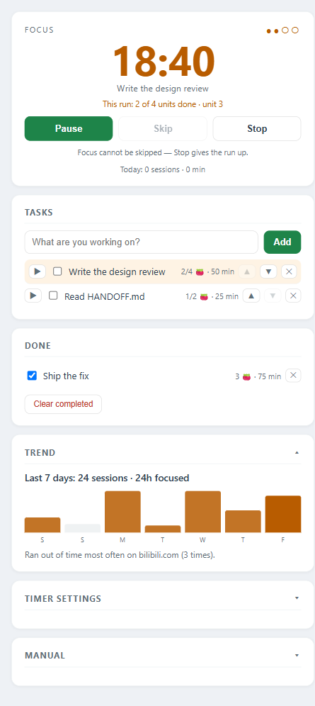

# Website Blocker

A Chrome extension that puts a pomodoro timer and a to-do list on top of a
site blocker, and lets each one hold the other up.



While a focus session is running, every site on your **timed** list is blocked
outright — there is no "five more minutes". The timer cannot be skipped, and a
single focus session can be paused **exactly once, for at most two minutes**,
after which the clock restarts itself. The blocker is what makes the timer mean
something; the timer is what makes the blocker usable.

Everything stays on your machine. No account, no server, no telemetry, and no
network calls anywhere in the code — see [PRIVACY.md](PRIVACY.md).

## What it does

- **Two kinds of rule.** `block` is always closed. `timed` gives you a daily
  allowance (say 30 min/day) and closes itself when you have spent it. A `!`
  prefix means the opposite: an exception that keeps a host and everything under
  it reachable — blocking `baidu.com` does not have to close `pan.baidu.com`.
- **Rule time windows.** A rule can apply only between certain hours, so
  "no YouTube before 6pm" is one rule rather than a chore.
- **Temporary unlocks.** A blocked page offers *Unlock 30 min*: the same allow
  rule as a `!` exception, with an expiry, which re-locks itself. The escape
  hatch does not require deleting the extension.
- **A pomodoro timer** with long breaks, auto-start, an optional chime, and a
  badge that shows the remaining minutes.
- **A to-do list** where a task carries an estimate in *units* (one unit = one
  focus session plus the break after it). Start a task, say how many units to
  spend, and the run keeps going until the count is spent — then it asks whether
  the task is actually done.
- **A 90-day trend**, local to the machine: sessions, minutes, and which site
  you ran out of time on most often.
- **A backup**, because the product's own rule is that removing the extension
  is the only unlock. Export everything to one JSON file first.

## Install

Not on the Chrome Web Store yet. Load it unpacked:

1. Download or clone this repository.
2. Open `chrome://extensions`, turn on **Developer mode**.
3. **Load unpacked** and pick the repository folder.
4. Reload it from that page after every `git pull` — reloading an unpacked
   extension does **not** re-grant the `notifications` permission on its own;
   if the timer says notifications are off, that is what it means.

Manifest V3, so any current Chrome or Edge. `chrome.commands` gives you `Alt+Shift+P` for the timer
window and `Alt+Shift+S` to pause or resume.

## How it works

Two layers of blocking, because one is not enough:

- `declarativeNetRequest` rules are derived from your list by the service worker
  and handed to Chrome. That is what stops a page before it loads.
- `content.js` runs at `document_start` in every frame as a second line of
  defence, for everything DNR cannot see — in-page navigation, sub-resources, a
  rule that changed a second ago.

The pomodoro is a wall-clock state machine whose only authority is an `endAt`
timestamp. A service worker gets parked, so nothing counts down in memory: an
alarm fires at the deadline, the once-a-minute tracking tick is the backstop,
and starting up aligns against the stored deadline. Closing the laptop mid-focus
and coming back three hours later credits **one** session, never a cascade.

Deeper notes — storage keys, the invariants that must not be broken, and the
traps that have already bitten — are in [HANDOFF.md](HANDOFF.md) (Chinese).
The product review and its four-tier roadmap are in
[PRODUCT-REVIEW.md](PRODUCT-REVIEW.md) (Chinese).

## Development

No build step, no dependencies: the extension is the files in the repository.
Tests are plain Node and Python.

```bash
# Syntax of the service worker
node --check background.js

# Pomodoro + blocker state machine, 37 scenarios
node test/pomodoro-harness.js background.js

# Streak integrity, 10 scenarios
node test/streak-harness.js background.js streaks.js

# The real thing: loads the extension into a real Chromium
pip install playwright && playwright install chromium
python test/browser-smoke.py
```

The harnesses run `background.js` inside a `vm` with fake `chrome.*` namespaces
and a clock you can fast-forward, which is how a test can cover "the machine
slept for three hours" in a millisecond. The browser smoke test opens a headed
window, because Chrome does not load extensions headless — and because the bugs
that hurt most (a service worker that throws on startup, a redirect Chrome
refuses to follow) are invisible to a `vm`.

Every scenario in `test/pomodoro-harness.js` is expected to be able to **fail**:
if you revert the fix it covers, it must go red. `P32`–`P37` were checked against
the commit before the features they describe.

## Privacy

[PRIVACY.md](PRIVACY.md) is the full statement. The short version: there is no
`fetch`, no `XMLHttpRequest`, no `sendBeacon`, no analytics, and no third party.
`content.js` reads `location.hostname` and `location.href` and compares them to
the rules you wrote; it never touches the DOM or anything you type.

## License

[MIT](LICENSE).

---

## 中文说明

一个把**番茄钟**、**待办清单**和**网站拦截**绑在一起的 Chrome 扩展：专注期里
timed 站点一律封死、计时**不能跳过**、一段专注**只准暂停一次且最多 2 分钟**。
拦截让计时有意义，计时让拦截用得下去。

- **规则**：`block` 永远封；`timed` 给每日额度，用完自动封；`!domain` 是例外，
  封 `baidu.com` 不必连 `pan.baidu.com` 一起封。
- **时段规则**：规则可以只在某几个小时的窗口里生效（支持跨午夜）。
- **临时放行**：被拦整页上有「Unlock 30 min」，到期自己收回，和 `!` 例外是同一套机制。
- **安装**：还没上架商店。`chrome://extensions` → 打开「开发者模式」→「加载已解压的扩展程序」→
  选这个仓库目录。每次 `git pull` 后要在那个页面点一次「重新加载」。
- **隐私**：不联网、无账号、无统计——完整声明见 [PRIVACY.md](PRIVACY.md)，
  页面里也有一节（番茄钟窗口最下面的 **Manual** 就是中文使用说明）。
- **开发**：无构建步骤。`node test/pomodoro-harness.js background.js` 等命令见上；
  代码现状、存储键、不能踩的坑都在 [HANDOFF.md](HANDOFF.md)。